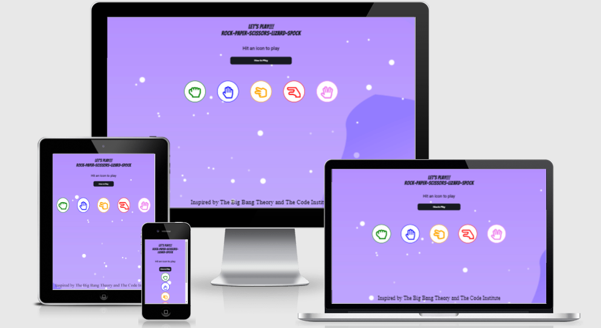

# Stephen D'Arcy - Rock - Paper - Scissors - Lizard - Spock Javascript Project.

# Table of Contents
1. [Rock-Paper-Scissors-Lizard-Spock](#The-Cupcake-Factory)
   * [About](#About)
   * [The business goals](#The-business-goals)
   * [The customer goals](#The-customer-goals)
2. [User Experience](#User-Experience)
   * [Project goals](#Project-goals)
   * [Design](#Design)
   * [User Stories](#User-Stories)
   * [Target Audience](#Target-Audience)
   * [Wireframes](#Wireframes)
3. [Features](#Features)
   * [Home Page](#Home-Page)
   * [Gallery Page](#Gallery-Page)
   * [Contact Page](#Contact-Page)
   * [Prices Page](#Prices-Page)
   * [All pages](#All-pages)
4. [Technology Used In Design](#Technology-Used-In-Design)
   * [HTML](#HTML)
   * [CSS](#CSS)
   * [Libraries](#Libraries)
5. [Testing](#Testing)
   * [Lighthouse Testing](#Lighthouse-Testing)
   * [Manual Testing](#Manual-Testing)
   * [Additional Testing ](#Additional-Testing)
6. [Deployment](#Deployment)
7. [Credits](#Credits)
   * [Code](#Code)
   * [Content](#Content)
8. [Bugs](#Bugs)
​
# The Cupcake Factory

### About
* A small fun interactive Javascript game that can be played by all. test your wits against the computer.  

### The business goals
* To build a fun interactive game that can be enjoyed by everyone.
* To provide an intuative interface for the user.

### The customer goals
* To visit and browse our products and to order their products with ease.
* Clear easy to find product pricing and delivery prices.

---
 
## User Experience

### Project goals:
* The main goal of the project is to advertise our business and products to a wider audience.
* To increase visitors to the website.
* To use the website as a platform to expand our business
​
### Design:
* The design is very simplistic and uses pastel colors to mirror what may be found on a lot of cakes and baked goods. It has a clear navigation menu and the page is clearly    labeled and it is easy to go from one page to another. 
* The images are sized correctly and each page is designed to look like the home page.
​
### User Stories
* As a user I want navigate between pages.
* As a user I want be able to view images pf products.
* As a user I want to be able to see the prices of products in a clear manner.
* As a user I want to be able to contact the company easily.

### Target Audience

* The target audience for our website is mainly adults looking to make purchase of our products and to view our product range.

### Wireframes

* All wireframes can be found [Here](docs/Wireframes.pdf)

#### [Back to content](#table-of-contents)
---

## Features

#### Home Page 

The home page features a hero image that is animated to draw the attention of the visitor to the purpose of our business. The image does remain animated from desktop down to mobile size. Under the hero image we have two small paragraphs outlining outlining why a customer should use our services and a question as to what we do. We have a list outlining some of the occasions we cater for and a call to action button to contact us if anything else is required or any special requests are needed.

Further down the home page I have three images that are animated to show the transformation of some of our bakes. These images are used as far down as tablet size but one we move to mobile sizes I have decided to hide the images to improve performance on small screen sizes.

#### Gallery Page

The Gallery page has a small selection of the cakes that we can produce. One the user hovers over them the are designed to stand out with a box shadow. The page also include tha call to action contact button in case the user would like to make contact and request one of the cakes in the gallery.

#### Contact Page

The Contact page follows the small design principles as the other pages. The animated hero image banner is located below the navigation menu. Below this hero image is our contact form. The form has certain fields that must be completed before submitting. There is a text box for messaging and some checkboxes for or more popular orders. One checkbox gives the customer the option to choose the size of their cupcake orders. Once the contact form has been completed the user will get a thank you message from a hidden page. 

#### Prices Page

The Prices page displays some of our prices for again our more popular cakes. This is coupled with separate prices for different size cakes. We have clearly outlined our delivery costs and that we only deliver to a certain geographical area. If any other delivery areas further  than stated we advise the customer to contact us with their request.

#### All Pages

The top of the page has an easy to use navigation bar that has a underlined border to emphasize where the user is on the website. All the pages have an animated banner, the opacity has been turned down slightly. This is engage the user and also visually show the user what the site represents and what our business is. 
The footer contains copyright information and links to social media sites that open in separate pages.

#### [Back to content](#table-of-contents)
---

## Technology Used In Design

### HTML

* HTML5 semantic code is used in all of the four website pages. There are clearly defined areas such as main, sections, headers and footers as well as list items and tables.

### CSS

* CSS has been used to add styles and animations to the site making the website more appealing for people visiting us. 

### Libraries

* [Google Fonts:](https://fonts.google.com/)
    - Google fonts was used to import the fonts Lato and Raleway that is used throughout the site.
* [Font Awesome:](https://fontawesome.com/)
    - Font Awesome was used to add icons for visual and user experience (UX) purposes.
* [Gitpod](https://gitpod.io/)
    - Gitpod was used to develop the website.
* [GitHub:](https://github.com/)
    - GitHub is used to store the projects code after being pushed from Git. And to host the project.
* [Birme Image Resizing:](https://www.birme.net/?target_width=700&target_height=100&auto_focal=false)
    - Image Resizer was used to resizing images and edit profile photos for the website.
* [Balsamic:](https://balsamiq.com/)
    - Balsamiq was used during the design process to create Wireframes.
* [Responsive Design Checker:](http://ami.responsivedesign.is/)
    - Am I Responsive was used in the testing process to check responsiveness on various devices.
* [W3C Markup Validator](https://validator.w3.org/#validate_by_input)
    - Used to validate the HTML code.
* [W3C CSS Validator](https://jigsaw.w3.org/css-validator/#validate_by_input)
    - Used to validate the CSS code.

#### [Back to content](#table-of-contents)
---

## Testing

Testing was manually completed through the use of Googles Chrome browser and Firefox browser in conjunction with their development tools accessed through their website.

## Lighthouse Testing

### User Stories Testing

* #### As a user I want navigate between pages.
On the home page in the top right their are navigation links that seamless work between each page the user wants to visit. The page the user is on is identified by the underlined border on each link as the click through the website.

* #### As a user I want be able to view images pf products.
When the user navigates to the Galley page the images for the products we offer are clearly laid out and visible to the user. They can hover over each image and the current image will transition a small bit with a shadow to indicate which image is being viewed.

* #### As a user I want to be able to see the prices of products in a clear manner.
The user can navigate through the navigation menu to the prices page where there is a list of our price laid out for different size products. We encourage the use of the contact page for any other requests that use may need.

* #### As a user I want to be able to contact the company easily.
The contact page is laid out with a contact from in the center of the page under the main hero image. Each field is identifiable and any fields that are required are called out when the user clicks the contact us button. There is also a rest button in case of any user mistakes.

### Manual Testing
1. Navigation - Repeated steps on all pages.

* Click on logo to confirm that it navigates to the home page.
* Click on all navigation links to verify that they direct to the correct pages.
* Verify that the current page the user is on, is highlighted as active in the menu with border underline.
* Verify that the navigation menu adjusts to the size of different screens. The navigation menu should shift from right to left and center for mobiles.

2. Home page
* Verification that the banner on the hero image plays when the page is loaded and continues to do so
* Verify that the animation on the three images plays once the page is loaded.
* Verify that the call to action contact button redirects to the correct page.

3. Gallery
* Verify that all images are showing in desktop, tablet and mobile.
* Verify that all images are responding to the hover effect.
* Verify that the call to action contact button redirects to the correct page.

4. Prices
* Verify that the prices table is reflecting the correct data.
* Verify that the page is responsive.
* Verify that the call to action contact button redirects to the correct page.

5. Contact
* Verify that all elements that are set to required are working.
* Verify that valid email address is needed with relevant '@' included.
* Verify that 'Submit' button directs user to the hidden thank you page.

6. Contact Form success
* Verify that navigation goes to the thank you page and the user can return to the home page if required.

7. Footer - Repeated steps on all pages.
* Verify that the social media links open in a new tab.

### Additional Testing  

W3C - HTML Validator

W3C - CSS Validator

#### [Back to content](#table-of-contents)

---

## Deployment

### Project creation

* I developed and deployed the Website using Github abd Gitpod as my code editor using the below steps:
1. Create your account using the email of choice.
1. Create a new repository giving it a name.
1. Click the Gitpod button to start the code editor.
1. Once the code was written I would recommend small commits rather than large ones using the below:
    * git add . .
    * git commit -m "Your message here"
    * git push 

### Deployment of existing site
* Log in to your Github page.
* Click settings and scroll down the left to find pages.
* From source click main.
* The site will be generated under a live address.
* This site can be found here: [The CupCake Factory](https://darco31.github.io/theCupCakeFactory/)

#### [Back to content](#table-of-contents)

---

## Credits

### Code

* Code construct credit to The Code Institute and their informative and well laid out lessons.
* Also credit to [W3 Schools](https://www.w3schools.com/), their lessons on tables and the Grid layout helped to further my understanding.
* Pictures and videos are from [Pexels](https://www.pexels.com/)

### Content
* All content written by the developer Stephen D'Arcy

* Thanks to my mentor Miguel for all his advice and help throughout the project. Also to the various people on Slack who helped with little bugs and always provided encouragement.
---

## Bugs

* Gitpod

Bug found in Gitpod where the text in the terminal is virtually unreadable making spelling mistakes hard to see when writing commit messages. This was identified as a known issue and was being investigated by the Gitpod teams.

Links when used in Gitpod are not working correctly. I had to push the changes to github and test from there. Gitpod is also showing some of the back to top links with the hashtags. Again this is not representative of the github page. I have come across a lot of issues in Gitpod that cause the developer to use more steps to verify their code.

* Code validation:

When I have validated all the code in W3 validator there are two known warnings to include headings. The headings are intentionally left out as there are not required. there is no content in the code.

* Internet Explorer 11

The hero banner is not covering the page and the maps state that the browser is not supported. As IE11 is not used as much and will be obsolete soon being replaced with MS Edge I believe it would be of no benefit to  fix the issue as it may cause issues on other more popular browsers.

#### [Back to content](#table-of-contents)