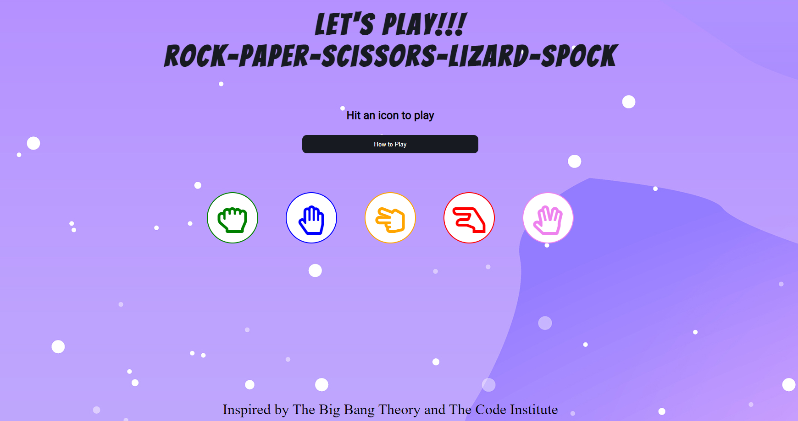
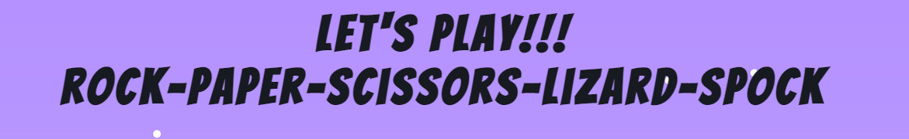
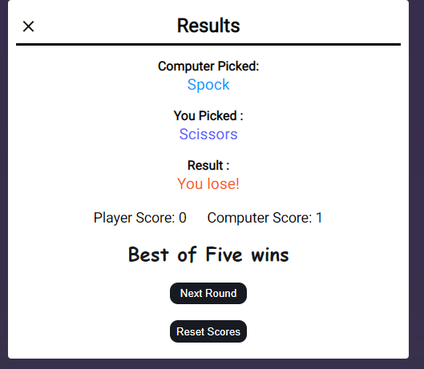
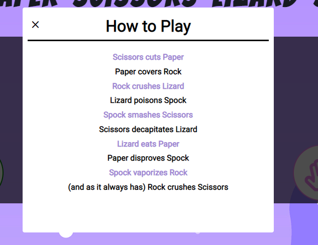
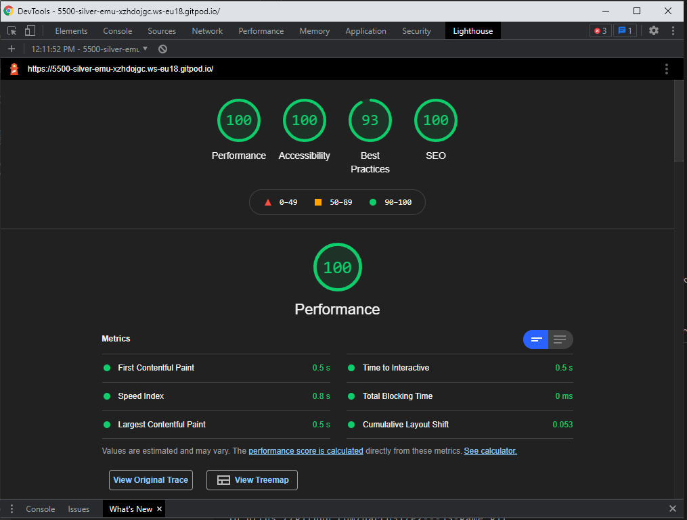
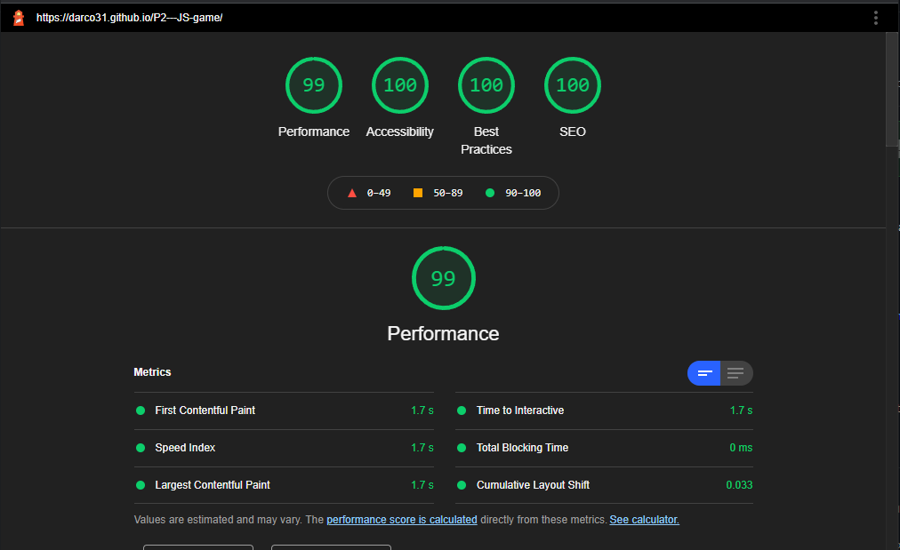
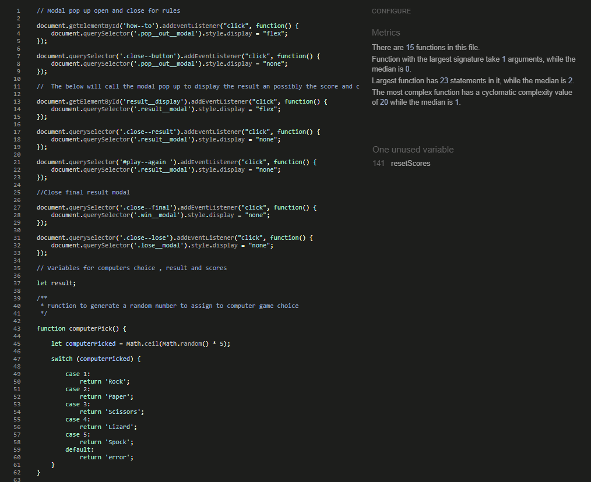
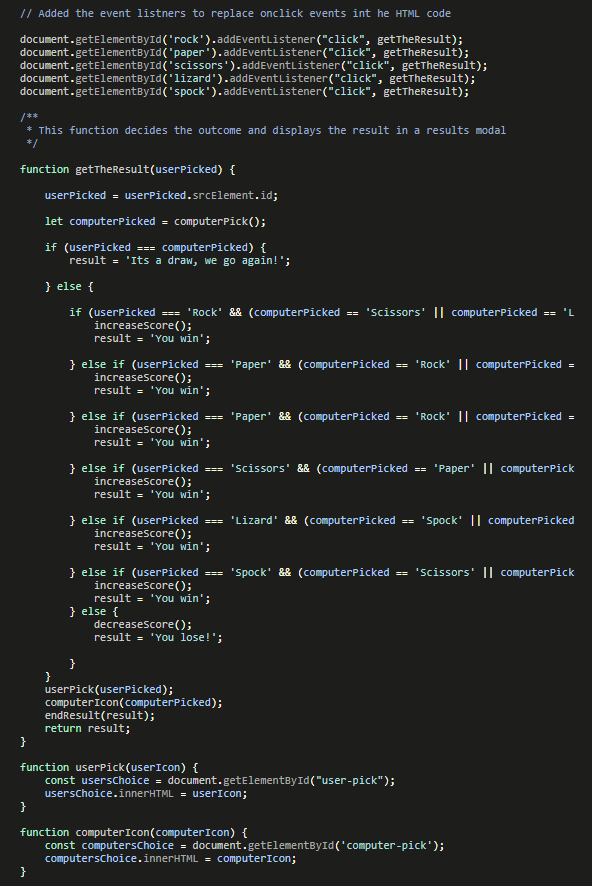
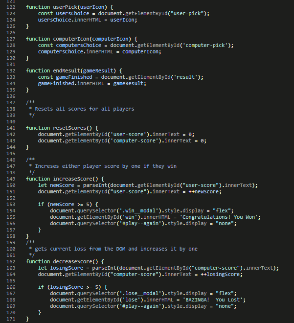

# Stephen D'Arcy - Rock - Paper - Scissors - Lizard - Spock Javascript Project.

# Table of Contents
1. [Rock-Paper-Scissors-Lizard-Spock](#The-Cupcake-Factory)
   * [About](#About)
   * [The business goals](#The-business-goals)
   * [The customer goals](#The-customer-goals)
2. [User Experience](#User-Experience)
   * [Project goals](#Project-goals)
   * [Design](#Design)
   * [User Stories](#User-Stories)
   * [Target Audience](#Target-Audience)
   * [Wireframes](#Wireframes)
3. [Features](#Features)
   * [Home Page](#Home-Page)
4. [Technology Used In Design](#Technology-Used-In-Design)
   * [HTML](#HTML)
   * [CSS](#CSS)
   * [JavaScript](#JS)
   * [Libraries](#Libraries)
5. [Testing](#Testing)
   * [Lighthouse Testing](#Lighthouse-Testing)
   * [JSHint Testing](#JSHint-results)
   * [Manual Testing](#Manual-Testing)
   * [Additional Testing ](#Additional-Testing)
6. [Deployment](#Deployment)
7. [Credits](#Credits)
   * [Code](#Code)
   * [Content](#Content)
8. [Bugs](#Bugs)
​
# Rock-Paper-Scissors-Lizard-Spock

### About
* A small fun interactive Javascript game that can be played by all. test your wits against the computer.  

### The business goals
* To build a fun interactive game that can be enjoyed by everyone.
* To provide an intuative interface for the user.

### The customer goals
* To have a clear understanding of the game and how to play it.
* Clear easy to read instructions and alerts avaiable at all times.

---
 
## User Experience

### Project goals:
* The main goal of the project is to showcase my game to a wider audience that can be played and is visually pleasing for all users.
* On positive feed back add functionality to the exsoisting game and add more games to the page.
​
### Design:
* The design uses a space themed background image eith bold fonts that contrast each other very well and allow the user to easily distiguish between headings and call to action buttons.
* The images are sized correctly and each page is designed to look like the home page.
​
### User Stories
* As a user I want to understand what I am looking at and its use.
* As a user I want to be able to understand the rules of the game and its objectives.
* As a user I want to be able to easily find the buttons I need to press.
* As a user I want to be able to view the results of each game.
* As a user I would like to be able to rest the scores on the bored.
* As a user I would like to be givena  visual alert on the winner of the game.

### Target Audience

* The target audience for our website is everyone young and old who enjoy games.

### Wireframes

* All wireframes can be found [Here](docs/Wireframes.pdf)

#### [Back to content](#table-of-contents)
---

## Features

#### Home Page 
There is only one page for this game , the homapge has a heading witht he name of the game. This set onto a purple background image.Just under the heading we have a call to action for the user to begin the game or a call to action button that will call a modal pop up that exaplins the rules of the game to the user.
Uder hte call to action buton we have designed five seperate buttons that are used to play the game. Once the user presses a button the game will begin. Afte each button push a new modal will popup displaying the result of that round. Another button will be available to the user to play the next round or rerset the scores. If the user picks the next round button the games continues , if they choose the reset scores button the scoreborad will be reset and the user can start again. Once the game has finished the user will get a pop up to inform them if they have won or the computer has won.

Below the game buttons the footer holds text regarding the inspiation behind teh game and all social media links.

#### [Back to content](#table-of-contents)
---

## Technology Used In Design

### HTML

* HTML5 semantic code is used on the main page. There are clearly defined areas such as main, sections, headers and footers as well as list items and tables.

### CSS

* CSS has been used to add styles and animations to the site making the website more appealing for people visiting us. 

### JavaScript

* Javascript has been used to make the game/site interactive for the user. The buttons and modals are all controlled by the Javascript.

### Libraries

* [Google Fonts:](https://fonts.google.com/)
    - Google fonts was used to import the fonts Lato and Raleway that is used throughout the site.
* [Font Awesome:](https://fontawesome.com/)
    - Font Awesome was used to add icons for visual and user experience (UX) purposes.
* [Gitpod](https://gitpod.io/)
    - Gitpod was used to develop the website.
* [GitHub:](https://github.com/)
    - GitHub is used to store the projects code after being pushed from Git. And to host the project.
* [Balsamic:](https://balsamiq.com/)
    - Balsamiq was used during the design process to create Wireframes.
* [Responsive Design Checker:](http://ami.responsivedesign.is/)
    - Am I Responsive was used in the testing process to check responsiveness on various devices.
* [W3C Markup Validator](https://validator.w3.org/#validate_by_input)
    - Used to validate the HTML code.
* [W3C CSS Validator](https://jigsaw.w3.org/css-validator/#validate_by_input)
    - Used to validate the CSS code.
* [JS Hint](https://jshint.com/)
    - Used to validate the JavaScript code.

#### [Back to content](#table-of-contents)
---

## Testing

Testing was manually completed through the use of Googles Chrome browser and Firefox browser in conjunction with their development tools accessed through their website. The game was also tested on mobile screens by family members.

## Lighthouse Testing

# Lighthouse Mobile Results:

# JSHint results

### User Stories Testing

#### As a user I want to understand what I am looking at and its use.
* The user should be able to tell what they are viewing and what they need to do to preoceed by the screen call to action buttons and the large heading with the name od   the game. 
#### As a user I want to be able to understand the rules of the game and its objectives.
* The call to action button clearly labelled "How to play" will give the user the game rules before starting.
#### As a user I want to be able to easily find the buttons I need to press.

#### As a user I want to be able to view the results of each game.

#### As a user I would like to be givena visual alert on the winner of the game.

#### As a user I want to be able to view the results of each game.

### Manual Testing
1. This is a one page application/game.

* Click on logo to confirm that it navigates to the home page.
* Click on all navigation links to verify that they direct to the correct pages.
* Verify that the current page the user is on, is highlighted as active in the menu with border underline.
* Verify that the navigation menu adjusts to the size of different screens. The navigation menu should shift from right to left and center for mobiles.

### Additional Testing  

W3C - HTML Validator

W3C - CSS Validator

JSHint - JavaScript Validator

#### [Back to content](#table-of-contents)

---

## Deployment

### Project creation

* I developed and deployed the Website using Github and Gitpod as my code editor using the below steps:
1. Create your account using the email of choice.
1. Create a new repository giving it a name.
1. Click the Gitpod button to start the code editor.
1. Once the code was written I would recommend small commits rather than large ones using the below:
    * git add . .
    * git commit -m "Your message here"
    * git push 

### Deployment of existing site
* Log in to your Github page.
* Click settings and scroll down the left to find pages.
* From source click main.
* The site will be generated under a live address.
* This site can be found here: [Rock-Paper-Scissors-Lizard-Spock](https://darco31.github.io/P2---JS-game/)

#### [Back to content](#table-of-contents)

---

## Credits

### Code

* Code construct credit to The Code Institute and their informative and well laid out lessons.
* Also credit to [W3 Schools](https://www.w3schools.com/), their lessons on tables and the Grid layout helped to further my understanding.
* Pictures and videos are from [Pexels](https://www.pexels.com/)

### Content
* All content written by the developer Stephen D'Arcy

* Thanks to my mentor Miguel for all his advice and help throughout the project. Also to the various people on Slack who helped with little bugs and always provided encouragement.
---

## Bugs

* Gitpod

Bug found in Gitpod where the text in the terminal is virtually unreadable making spelling mistakes hard to see when writing commit messages. This was identified as a known issue and was being investigated by the Gitpod teams.

Links when used in Gitpod are not working correctly. I had to push the changes to github and test from there. Gitpod is also showing some of the back to top links with the hashtags. Again this is not representative of the github page. I have come across a lot of issues in Gitpod that cause the developer to use more steps to verify their code.

* Code validation:

When I have validated all the code in W3 validator there are two known warnings to include headings. The headings are intentionally left out as there are not required. there is no content in the code.

* Internet Explorer 11

The hero banner is not covering the page and the maps state that the browser is not supported. As IE11 is not used as much and will be obsolete soon being replaced with MS Edge I believe it would be of no benefit to  fix the issue as it may cause issues on other more popular browsers.

#### [Back to content](#table-of-contents)